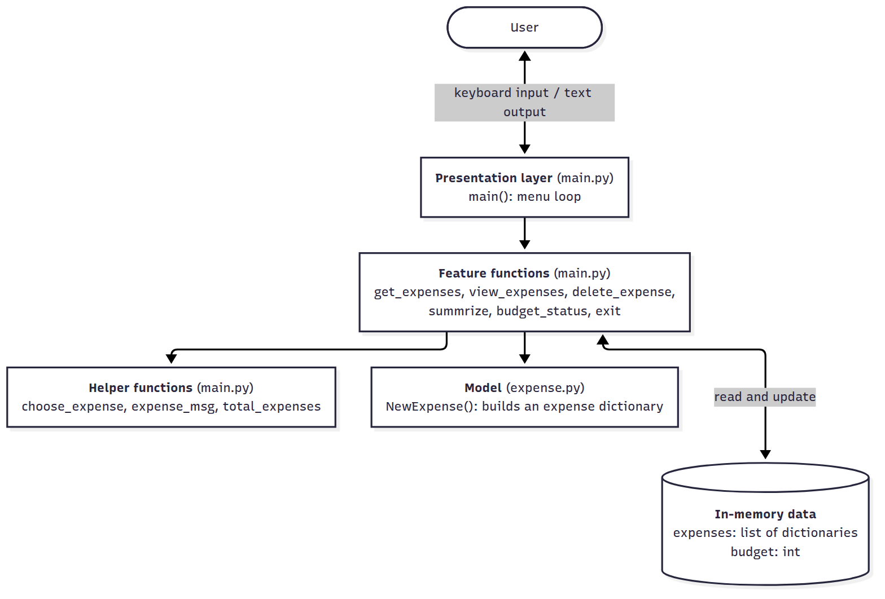
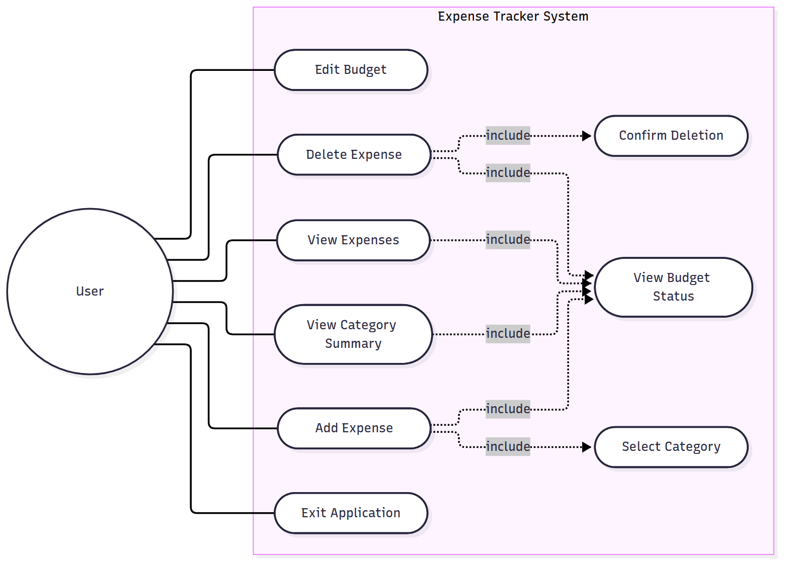
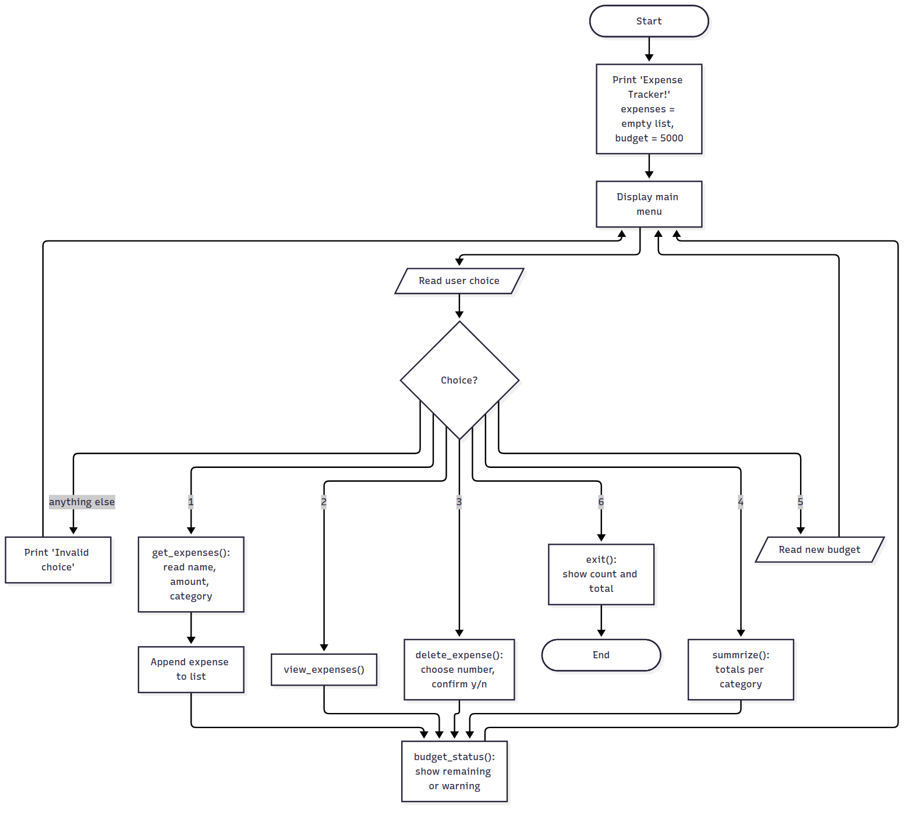
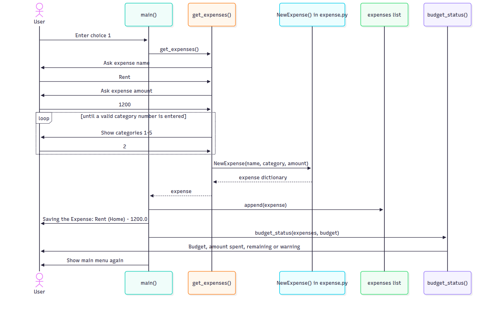
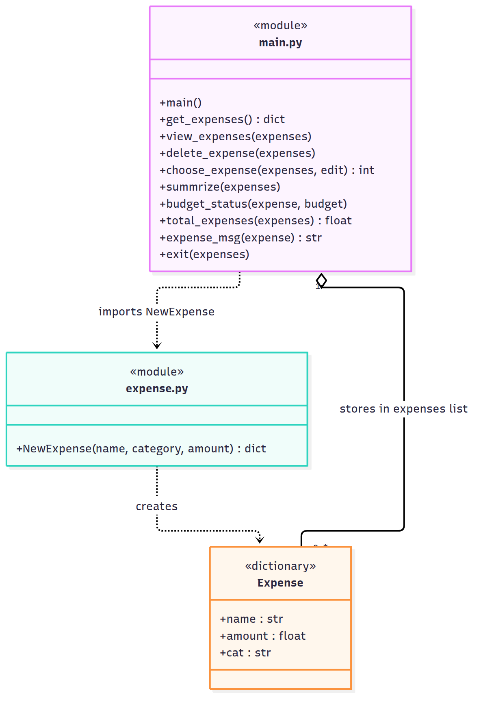

<!--
=====================================================================
HOW TO USE THIS FILE (delete this whole comment block before submitting)
=====================================================================
This comment is not shown when the Markdown is rendered.

1. FILL IN PLACEHOLDERS
   Search for "[" and replace every [placeholder] with your details
   (name, registration number, course, faculty, slot, date).

2. THE images/ FOLDER
   The images/ folder already exists next to this file.
   Save every screenshot there with the file name given below.

3. DIAGRAMS (Figures 1-5): ALREADY DONE
   The five diagrams are ready as PNG files in images/ and appear
   in the report automatically. Their editable source is in
   diagrams/*.mmd. If you change the code and need to update a
   diagram: open https://mermaid.live, paste the .mmd file's
   contents, click "Actions" -> "PNG", and save it over the old
   file in images/ with the same name.

4. SCREENSHOTS (Figures 6-14)
   Each box in Section 9 tells you exactly what to type and what
   must be visible. Run the app with:  python main.py
   - Windows: Win + Shift + S, then drag over the terminal
   - Mac: Cmd + Shift + 4, then drag over the terminal
   - Linux: PrtSc or the Screenshot app
   Save with the given file name in images/, then replace the box
   with the image line shown in it.
   Tip: make the terminal window big and the font large enough
   to read when printed.

5. MAKE THE PDF (the portal needs a PDF)
   Option A (easiest): VS Code + the "Markdown PDF" extension
            (by yzane). Open this file, right-click in the editor,
            choose "Markdown PDF: Export (pdf)".
   Option B: Copy the rendered text from GitHub into Google Docs or
            Word, insert the images, then File -> Download -> PDF.
   The <div style="page-break-after: always;"></div> lines start a
   new page in Option A and are invisible on GitHub.

6. BEFORE SUBMITTING
   [ ] All [placeholders] filled in
   [ ] All 9 screenshots (Figures 6-14) inserted, no
       "Attach image" boxes left
   [ ] Test table (Section 10) still matches your code. If you fix
       a bug, re-run that test and update its Actual / Status.
   [ ] This comment block deleted
=====================================================================
-->

<div align="center">

# Expense Tracker

## A Menu-Driven Command-Line Expense Management Application in Python

<br>

**Project Report**

Submitted as part of the **VITyarthi – Build Your Own Project** evaluation

<br>

**Course:** [Course Name] ([Course Code])

<br>

| | |
|---|---|
| **Submitted by** | [Your Full Name] |
| **Registration Number** | [Your Registration Number] |
| **Submitted to** | [Faculty Name] |
| **Slot** | [Slot] |
| **Date of Submission** | [DD Month YYYY] |
| **GitHub Repository** | https://github.com/1divyansh/Expense-tracker- |

<br>

[Name of Your School / Department]<br>
[University Name]

</div>

<div style="page-break-after: always;"></div>

## Table of Contents

1. [Introduction](#1-introduction)
2. [Problem Statement](#2-problem-statement)
3. [Functional Requirements](#3-functional-requirements)
4. [Non-Functional Requirements](#4-non-functional-requirements)
5. [System Architecture](#5-system-architecture)
6. [Design Diagrams](#6-design-diagrams)
7. [Design Decisions & Rationale](#7-design-decisions--rationale)
8. [Implementation Details](#8-implementation-details)
9. [Screenshots / Results](#9-screenshots--results)
10. [Testing Approach](#10-testing-approach)
11. [Challenges Faced](#11-challenges-faced)
12. [Learnings & Key Takeaways](#12-learnings--key-takeaways)
13. [Future Enhancements](#13-future-enhancements)
14. [References](#14-references)

<div style="page-break-after: always;"></div>

## 1. Introduction

Managing day-to-day spending is a common problem, especially for students who live on a fixed monthly allowance. Small expenses such as snacks, travel and subscriptions add up quickly, and without a record it is hard to know where the money went or whether the month's budget has already been crossed.

**Expense Tracker** is a menu-driven command-line application written in Python that helps a user record expenses, group them into categories, see a category-wise summary, and compare total spending against a budget. The user works through a simple numbered menu, so no technical knowledge is needed.

The project applies core programming concepts from the course:

- **Functions and modular design:** each feature is its own function, and expense creation is kept in a separate file (`expense.py`)
- **Data structures:** a *list* holds all expenses, each expense is a *dictionary*, and a dictionary is also used to group totals by category
- **Control flow:** a `while` loop drives the menu, `if`/`elif` chooses the action, and `for` loops process the data
- **User input and formatted output:** `input()`, type conversion with `int()`/`float()`, and f-strings
- **Version control:** the project was developed and tracked using Git and GitHub

### 1.1 Technologies and Tools Used

| Item | Details |
|---|---|
| Programming language | Python 3 (version 3.6 or newer) |
| Libraries | None. Only Python built-in functions are used. |
| Interface | Command-line interface (terminal) |
| Version control | Git, with the repository hosted on GitHub |
| Editor / IDE | [e.g. VS Code / PyCharm / IDLE] |
| Diagrams | Mermaid (https://mermaid.js.org); source files in `diagrams/` |

<div style="page-break-after: always;"></div>

## 2. Problem Statement

People, and students in particular, often do not keep track of their daily expenses. As a result they:

- do not know how much they have spent in total,
- cannot tell which category (food, home, entertainment and so on) takes most of their money, and
- find out they have gone over budget only when the money has run out.

Spreadsheets and finance apps exist, but they can feel heavy for someone who just wants to note down a few expenses quickly. There is a need for a **lightweight, easy-to-use tool** that records expenses, organises them by category, and warns the user when spending crosses a budget.

### 2.1 Objectives

1. Let the user **add expenses** with a name, an amount and a category.
2. Let the user **view** and **delete** recorded expenses.
3. Show a **category-wise summary** with totals, percentages and a simple text bar chart.
4. Let the user **set a budget** and show the remaining amount, with a **warning** when spending goes over it.
5. Keep the program **simple, fast and dependency-free**, so it runs on any computer that has Python installed.
6. Apply course concepts (functions, lists, dictionaries, loops, conditionals, input/output) in a clean, modular way.

### 2.2 Scope

**In scope:**
- Adding, viewing and deleting expenses during one run of the program
- Five fixed categories: Food, Home, Work, Entertainment, Misc
- Category-wise summary and budget tracking
- Command-line menu interface

**Out of scope (current version):**
- Saving data after the program closes (data is kept in memory only)
- Dates, monthly reports or multiple users
- A graphical user interface

### 2.3 Target Users

- Students managing a monthly allowance
- Individuals who want a quick, simple way to track daily spending
- Beginner programmers who want to study a small but complete Python project

<div style="page-break-after: always;"></div>

## 3. Functional Requirements

The system is organised into **five functional modules**.

| ID | Module | Requirement | Input | Output |
|---|---|---|---|---|
| FR-1 | Expense Entry | The user can add an expense with a name, an amount and a category chosen from a numbered list. | Name (text), amount (number), category number (1–5) | Confirmation such as `Saving the Expense: Rent (Home) - 1200.0` |
| FR-2 | Expense Listing | The user can view all recorded expenses as a numbered list. | Menu choice `2` | Numbered list, or `[] No expenses recorded` if empty |
| FR-3 | Expense Deletion | The user can delete an expense by its number after confirming. Pressing Enter without a number cancels. | Expense number, then `y` / `n` | `Deleted ...` or `Cancelled.` |
| FR-4 | Reporting / Analytics | The user can view a summary of spending per category with amount, percentage and a text bar chart, plus the grand total. | Menu choice `4` | Category-wise table and `Total spent` |
| FR-5 | Budget Management | The budget starts at Rs.5000 and the user can change it. After adding, viewing, deleting or summarising, the system shows the budget, the amount spent, and either the remaining amount or an over-budget warning. | New budget (whole number) | `[] budget: Rs.X, spent: Y` and `Remaining Budget` or `WARNING` |
| FR-6 | Session Control | The main menu repeats until the user exits. An invalid menu choice shows an error and the menu again. On exit, the number of expenses and the total spent are shown. | Menu choice `1`–`6` | Menu, error message, or exit summary |

### 3.1 Input / Output Structure

- **Input:** all input is typed at the keyboard in response to clear prompts, for example `Enter your choice [1 - 6]:` and `Enter expense amount:`.
- **Output:** all output is plain text in the terminal. Sections are separated by lines of dashes, and status messages start with `[]` so they stand out.

### 3.2 User Workflow

1. Start the program. The main menu appears.
2. Choose **1** to add expenses (repeat as needed).
3. Choose **2** to view them, or **4** to see the category summary.
4. Choose **5** to change the budget if needed. Budget status is shown after each action.
5. Choose **3** to delete a wrong entry.
6. Choose **6** to exit and see the session summary.

<div style="page-break-after: always;"></div>

## 4. Non-Functional Requirements

| ID | Category | Requirement | How it is met |
|---|---|---|---|
| NFR-1 | Usability | The app must be usable without any training. | Numbered menus, the valid range shown in every prompt (e.g. `[1 - 6]`), clear confirmations, and a `y/n` question before deleting. |
| NFR-2 | Performance | Every action should respond instantly. | All data is in memory. Adding is O(1); viewing, totals and summary are O(n) single passes over the list. |
| NFR-3 | Portability | The app must run on Windows, macOS and Linux. | Pure Python 3 with no third-party libraries and no platform-specific code. |
| NFR-4 | Maintainability | Code should be easy to read and extend. | One function per feature, a separate `expense.py` for creating expenses, shared helpers (`expense_msg`, `total_expenses`) instead of repeated code, and history tracked in Git. |
| NFR-5 | Resource Efficiency | The app should use very little memory and disk. | Only a list of small dictionaries is stored. No files, database or background processes. |
| NFR-6 | Error Handling | Invalid choices must not break the menu. | Invalid menu choices and out-of-range category numbers show a message and ask again. *(Known limitation: non-numeric numbers are not handled yet; see Sections 10 and 13.)* |
| NFR-7 | Privacy / Security | The user's financial data must not leak. | Nothing is written to disk or sent over a network. All data is cleared when the program ends. |

<div style="page-break-after: always;"></div>

## 5. System Architecture

The application follows a simple **layered architecture** inside a single process:

1. **Presentation layer:** the `main()` function shows the menu, reads the user's choice and calls the right feature function.
2. **Feature (logic) layer:** one function per feature: `get_expenses`, `view_expenses`, `delete_expense`, `summrize`, `budget_status` and `exit`.
3. **Helper layer:** small reusable functions: `choose_expense`, `expense_msg` and `total_expenses`.
4. **Model:** `NewExpense()` in `expense.py` builds a single expense record (a dictionary).
5. **Data (in memory):** the `expenses` list and the `budget` value, both created in `main()` and passed to the functions that need them.



<div style="page-break-after: always;"></div>

## 6. Design Diagrams

### 6.1 Use Case Diagram

There is one actor, the **User**, who interacts with the system through the menu.



### 6.2 Workflow Diagram

The program runs as a loop: show the menu, carry out the chosen action, and return to the menu until the user exits.



### 6.3 Sequence Diagram: Adding an Expense



### 6.4 Component Diagram

The project does not use classes, so a **component diagram** shows the two modules, their functions, and the expense record (a dictionary) that they work with.



### 6.5 ER Diagram / Storage Design

**Not applicable.** The application does not use a database or files. All data lives in memory while the program runs. The in-memory data structure is described below instead.

**Expense record (Python dictionary)**

| Key | Type | Example | Description |
|---|---|---|---|
| `name` | `str` | `"Rent"` | What the money was spent on |
| `amount` | `float` | `1200.0` | Amount spent, in rupees |
| `cat` | `str` | `"Home"` | One of: Food, Home, Work, Entertainment, Misc |

**Program state (created in `main()`)**

| Variable | Type | Initial value | Description |
|---|---|---|---|
| `expenses` | `list` of expense dictionaries | `[]` | All expenses added in this session, in the order they were added |
| `budget` | `int` | `5000` | The spending limit in rupees |

<div style="page-break-after: always;"></div>

## 7. Design Decisions & Rationale

| Decision | Alternatives considered | Reason for the choice |
|---|---|---|
| **Command-line menu interface** | GUI (Tkinter), web app | Keeps the focus on core programming logic; runs anywhere Python runs; a numbered menu is easy for any user. |
| **Dictionary for each expense** | A class with attributes, a tuple | A dictionary is simple, readable (`expense["amount"]`), and needs no extra class code. Named keys are clearer than tuple positions. |
| **List to hold all expenses** | Dictionary keyed by ID, database | Keeps the order expenses were added in, and the list position gives each expense a natural number for viewing and deleting. |
| **In-memory storage only** | CSV / JSON file, SQLite | Keeps the program simple with no file handling or file-corruption risk. It also means no financial data is left on the computer. Saving to a file is planned as a future enhancement. |
| **Separate `expense.py` with `NewExpense()`** | Build the dictionary inline in `main.py` | Keeps the structure of an expense in one place. If a field is added later (e.g. a date), only one function changes. |
| **Fixed list of five categories** | Free-text category | Picking a number avoids typos like "food" vs "Food", which would split the summary into two groups. |
| **Budget with a default of Rs.5000** | No budget until the user sets one | The user gets budget feedback right away. It can be changed at any time from the menu. |
| **Delete asks for confirmation** | Delete immediately | Prevents losing data by pressing the wrong number. |
| **Helper functions `expense_msg()` and `total_expenses()`** | Repeat the same code in each feature | Removes duplicate code, so formatting and total calculation stay consistent everywhere. |
| **No external libraries** | e.g. `tabulate`, `matplotlib` | No installation step, and every line of the program shows core Python concepts. The bar chart is drawn with `"#"` characters. |

<div style="page-break-after: always;"></div>

## 8. Implementation Details

### 8.1 Project Structure

```
Expense-tracker-/
├── main.py            # Menu loop and all feature functions (166 lines)
├── expense.py         # NewExpense(): creates an expense dictionary
├── README.md          # Overview, features and how to run
├── projectreport.md   # This report
├── images/            # Diagrams and screenshots used in the report
├── diagrams/          # Mermaid source for the diagrams
└── .gitignore         # Keeps __pycache__/ out of Git
```

**To run:** `python main.py` (or `python3 main.py` on macOS / Linux). There is nothing to install.

### 8.2 Creating an Expense (`expense.py`)

```python
def NewExpense(name, category, amount):
    expense = {
        "name": name,
        "amount": amount,
        "cat": category,
         }
    return expense
```

This function is the single place where the structure of an expense is defined.

### 8.3 Main Menu Loop (`main()`)

`main()` creates the program state and repeats the menu until the user chooses Exit. Each choice calls one feature function.

```python
def main():
    print(f"Expense Tracker!")
    expenses = []
    budget = 5000
    ...
    while True:
        ...
        inp = input("Enter your choice [1 - 6]: ").strip()

        if inp == "1":
            expense = get_expenses()
            expenses.append(expense)
            print(f"Saving the Expense: {expense_msg(expense)}")
            budget_status(expenses, budget)
        elif inp == "2":
            view_expenses(expenses)
            budget_status(expenses, budget)
        ...
        elif inp == "6":
            exit(expenses)
            break
        else:
            print("Invalid choice. Please try again!")
```

`.strip()` removes extra spaces, so an input like `" 1 "` still works. Comparing strings (`"1"`) instead of converting to `int` means a letter typed at the menu cannot crash the program.

### 8.4 Adding an Expense (`get_expenses()`)

The function reads the name and amount, then loops until a valid category number is entered:

```python
while True:
    print("Select a category: ")
    for i, category_name in enumerate(categories):
        print(f"{i + 1}. {category_name}")

    category_index = (int(input(f"Enter categrory number [1 - {len(categories)}]: ")) - 1)

    if category_index in range(len(categories)):
        new_expense = NewExpense(name=name, category=categories[category_index], amount=ammount)
        return new_expense
    else:
        print("Invalid category. please try again!")
```

`enumerate()` numbers the categories from 1 for the user, and `- 1` converts back to a list index starting at 0. `in range(...)` checks that the number is valid.

### 8.5 Category Summary (`summrize()`)

A dictionary groups the totals by category in one pass, then each category's share of the total is shown as a percentage and a bar:

```python
amount_by_cat = {}
for data in expenses:
    key = data["cat"]
    if key in amount_by_cat:
        amount_by_cat[key] += data["amount"]
    else:
        amount_by_cat[key] = data["amount"]

total = total_expenses(expenses)

for cat, amount in amount_by_cat.items():
    percent = amount / total * 100
    bar = "#" * max(1, round(percent / 5))
    print(f" [] {cat}: {amount} ({percent}%) {bar}")
```

Each `#` stands for about 5% of total spending. `max(1, ...)` makes sure even a very small category gets at least one `#`.

### 8.6 Budget Status (`budget_status()`)

```python
def budget_status(expense, budget=5000):
    total = total_expenses(expense)
    print(f"[] budget: Rs.{budget}, spent: {total}")

    if (total > budget):
        print(f" [] WARNING: you have exceeded the budget by {total - budget}")
    else:
        print(f" [] Remaining Budget: {budget - total}")
```

### 8.7 Deleting an Expense (`delete_expense()` and `choose_expense()`)

`choose_expense()` lists the expenses and returns the chosen list index, or `None` if the user presses Enter to cancel. `delete_expense()` then asks for confirmation and removes the item with `list.pop()`:

```python
confirm = input(f"[] Delete {expense_msg(expenses[i])} ? (y/n)").lower().strip()

if confirm in ("y", "yes"):
    removed = expenses.pop(i)
    print(f"Deleted {expense_msg(removed)}")
else:
    print("Cancelled.")
```

`.lower()` means `Y`, `y`, `YES` and `yes` are all accepted.

### 8.8 Time Complexity

| Operation | Complexity | Reason |
|---|---|---|
| Add expense | O(1) | `list.append()` |
| View expenses | O(n) | One loop over the list |
| Total spent | O(n) | One loop over the list |
| Category summary | O(n) | One pass to group, plus a loop over at most 5 categories |
| Delete expense | O(n) | `list.pop(i)` shifts the items after `i` |

### 8.9 Version Control (Git and GitHub)

The project was developed in the GitHub repository **https://github.com/1divyansh/Expense-tracker-**, with each step committed separately:

| Commit | Date | Description |
|---|---|---|
| `0b7d71b` | 28 Sep 2026 | First working version built from the starter template |
| `b72ea4f` | 28 Sep 2026 | Rewrite as an in-memory app with a menu loop |
| `bc7c1b7` | 29 Sep 2026 | Add edit / delete, category summary, budget and input checks |
| `af230ab` | 29 Sep 2026 | Update `main.py` (current menu and features) |
| `d10e1c1` | 29 Sep 2026 | Create `expense.py` |
| `f5da52d` | 29 Sep 2026 | Add README |

*(Update this table with `git log --oneline` if you add more commits.)*

<div style="page-break-after: always;"></div>

## 9. Screenshots / Results

Run the program with `python main.py` and take the screenshots below. The text under each box shows the output you should see.

### 9.1 Program Start and Main Menu

> **📷 Attach image: Figure 6 (Main Menu)**
> **Do:** run `python main.py`. Take the screenshot as soon as the menu appears.
> **Must show:** `Expense Tracker!` and all six menu options.
> **Save as:** `images/fig6-main-menu.png`, then replace this box with:
> ``

```
Expense Tracker!
No expense Recorded yet.
------------------------------------------

 Main Menu
1. Add Expenses
2. View Expense
3. Delete Expense
4. View Summary
5. Edit Budget
6. Exit
Enter your choice [1 - 6]:
```

### 9.2 Adding an Expense

> **📷 Attach image: Figure 7 (Adding an Expense)**
> **Do:** type `1`, then name `Rent`, amount `1200`, category `2`.
> **Must show:** the category list, the `Saving the Expense` line and the budget status.
> **Save as:** `images/fig7-add-expense.png`, then replace this box with:
> ``

```
Getting User Expenses
Enter expense name: Rent
Enter expense amount: 1200
Select a category:
1. Food
2. Home
3. Work
4. Entertainment
5. Misc
Enter categrory number [1 - 5]: 2
Saving the Expense: Rent (Home) - 1200.0
[] budget: Rs.5000, spent: 1200.0
 [] Remaining Budget: 3800.0
```

### 9.3 Viewing Expenses

> **📷 Attach image: Figure 8 (Viewing Expenses)**
> **Do:** also add `Coffee`, `50`, category `1` and `Movie`, `300`, category `4`. Then type `2`.
> **Must show:** the numbered list of all three expenses and the budget status.
> **Save as:** `images/fig8-view-expenses.png`, then replace this box with:
> ``

```
[] Your Expenses
 1. Rent (Home) - 1200.0
 2. Coffee (Food) - 50.0
 3. Movie (Entertainment) - 300.0
[] budget: Rs.5000, spent: 1550.0
 [] Remaining Budget: 3450.0
```

### 9.4 Category Summary

> **📷 Attach image: Figure 9 (Category Summary)**
> **Do:** with the same three expenses, type `4`.
> **Must show:** each category with its amount, percentage and `#` bar, plus `Total spent`.
> **Save as:** `images/fig9-summary.png`, then replace this box with:
> ``

```
[] Expenses by category:
 [] Home: 1200.0 (77.41935483870968%) ###############
 [] Food: 50.0 (3.225806451612903%) #
 [] Entertainment: 300.0 (19.35483870967742%) ####
[] Total spent: 1550.0
```

### 9.5 Budget Warning

> **📷 Attach image: Figure 10 (Over-Budget Warning)**
> **Do:** type `5` and enter `1000` as the new budget. Then type `2` (or add another expense).
> **Must show:** `[] budget: Rs.1000, spent: 1550.0` and the `WARNING` line.
> **Save as:** `images/fig10-budget-warning.png`, then replace this box with:
> ``

```
[] budget: Rs.1000, spent: 1550.0
 [] WARNING: you have exceeded the budget by 550.0
```

### 9.6 Deleting an Expense

> **📷 Attach image: Figure 11 (Deleting an Expense)**
> **Do:** type `3`, choose expense `2`, then answer `y`.
> **Must show:** the confirmation question and the `Deleted` message.
> **Save as:** `images/fig11-delete.png`, then replace this box with:
> ``

```
Choose which expense to delete
 1. Rent (Home) - 1200.0
 2. Coffee (Food) - 50.0
 3. Movie (Entertainment) - 300.0
Choose expense number [1 - 3]: 2
[] Delete Coffee (Food) - 50.0 ? (y/n)y
Deleted Coffee (Food) - 50.0
```

### 9.7 Handling Invalid Input

> **📷 Attach image: Figure 12 (Invalid Input)**
> **Do:** at the menu type `9`. Then type `1`, add any name and amount, and enter category `7`, followed by a valid category.
> **Must show:** `Invalid choice. Please try again!` and `Invalid category. please try again!`
> **Save as:** `images/fig12-invalid-input.png`, then replace this box with:
> ``

### 9.8 Exiting the Program

> **📷 Attach image: Figure 13 (Exit Summary)**
> **Do:** type `6`.
> **Must show:** the number of expenses recorded, the total spent and `gg goodbye!`
> **Save as:** `images/fig13-exit.png`, then replace this box with:
> ``

```
You recorded 2 expenses on this run.
Total spent: 1500.0
gg goodbye!
```

### 9.9 GitHub Repository and Commit History

> **📷 Attach image: Figure 14 (Commit History)**
> **Do:** open https://github.com/1divyansh/Expense-tracker- in a browser, switch to the branch that has your latest code, and click the **Commits** link (clock icon).
> **Must show:** the list of commits with their messages and dates.
> **Save as:** `images/fig14-git-history.png`, then replace this box with:
> ``

<div style="page-break-after: always;"></div>

## 10. Testing Approach

### 10.1 Method

The application was tested with **manual black-box testing**: each feature was run with normal inputs, boundary inputs and invalid inputs, and the actual output was compared with the expected output. Test inputs were also fed to the program automatically through standard input (for example `printf '1\nRent\n1200\n2\n6\n' | python main.py`) so the same test could be repeated exactly after every change.

The tests cover three groups:

1. **Normal use:** every menu option with valid input
2. **Edge cases:** empty list, budget exceeded, cancelling a delete
3. **Invalid input:** wrong menu choice, wrong category, non-numeric and negative numbers

### 10.2 Test Cases and Results

| ID | Module | Test input | Expected result | Actual result | Status |
|---|---|---|---|---|---|
| TC-01 | Add | `1`, `Rent`, `1200`, `2` | Expense saved as Rent (Home) | `Saving the Expense: Rent (Home) - 1200.0` | ✅ Pass |
| TC-02 | View | `2` after adding two expenses | Numbered list of both | Both expenses listed as 1 and 2 | ✅ Pass |
| TC-03 | View | `2` with no expenses | "No expenses" message | `[] No expenses recorded` | ✅ Pass |
| TC-04 | Summary | `4` with Home and Food expenses | Totals, % and bar for each | Both categories shown with % and `#` bar | ✅ Pass |
| TC-05 | Summary | `4` with no expenses | "No expenses" message | `No expense Recorded yet.` | ✅ Pass |
| TC-06 | Budget | Budget `1000`, add expense of `1200` | Over-budget warning | `WARNING: you have exceeded the budget by 200.0` | ✅ Pass |
| TC-07 | Budget | `5`, `2000`, then `2` | Remaining budget is 2000 | `Remaining Budget: 2000` | ✅ Pass |
| TC-08 | Menu | `9` | Error, menu shown again | `Invalid choice. Please try again!` | ✅ Pass |
| TC-09 | Add | Category `9`, then `1` | Error, then asks again | `Invalid category. please try again!`, then saved | ✅ Pass |
| TC-10 | Delete | Two expenses, `3`, `2`, `y` | Expense 2 removed | Only expense 1 remains | ✅ Pass |
| TC-11 | Delete | Two expenses, `3`, `2`, `n` | Nothing removed | `Cancelled.`, both remain | ✅ Pass |
| TC-12 | Delete | `3` with no expenses | "No expenses" message | `There is no expense Recorded` | ✅ Pass |
| TC-13 | Exit | `6` | Count, total and goodbye | `You recorded 2 expenses on this run.` … `gg goodbye!` | ✅ Pass |
| TC-14 | Delete | Two expenses, `3`, `1` | Asks to confirm, deletes expense 1 | Returns silently, nothing deleted | ❌ Fail |
| TC-15 | Delete | `3`, `0`, `y` | Error: invalid number | Deletes the **last** expense | ❌ Fail |
| TC-16 | Delete | `3`, `abc` | Error, asks again | Program stops with `ValueError` | ❌ Fail |
| TC-17 | Add | Amount `abc` | Error, asks again | Program stops with `ValueError` | ❌ Fail |
| TC-18 | Add | Category `x` | Error, asks again | Program stops with `ValueError` | ❌ Fail |
| TC-19 | Add | Amount `-50` | Rejected: amount must be > 0 | Accepted; total spent becomes negative | ❌ Fail |
| TC-20 | Budget | `5`, `1500.50` | Accept decimal budget or show error | Program stops with `ValueError` | ❌ Fail |

### 10.3 Summary of Results

- **13 of 20 tests passed.** All the main features work correctly with valid input.
- **7 tests failed**, and they all come from **missing input validation**, not from wrong calculations:
  - `int()` and `float()` raise `ValueError` when the text is not a number (TC-16, 17, 18, 20).
  - `choose_expense()` does not check that the number is between 1 and the number of expenses. The input `0` becomes index `-1`, which Python treats as the last item (TC-15).
  - `delete_expense()` checks `if not i:` to detect "cancelled". Since `0` is treated as False in Python, choosing expense 1 (index 0) is treated as a cancel (TC-14). Checking `if i is None:` fixes this.
  - Amounts are not checked to be greater than zero (TC-19).

The fixes for these cases are listed in Section 13.

<div style="page-break-after: always;"></div>

## 11. Challenges Faced

1. **Bugs in the starter template.** The given template defined `save_expense()` twice, so the second definition silently replaced the first. It also called the function without the argument it needed, which causes a `TypeError`. Understanding *why* Python allowed the duplicate definition was an important first step.
2. **Choosing how to store data.** Saving expenses to a CSV file was considered, but in-memory storage was chosen to keep the project focused on data structures and program logic. The trade-off is that data is lost when the program closes.
3. **Handling invalid input.** Converting input with `int()` and `float()` crashes the program if the user types letters. Testing showed which inputs break the program (Section 10), and handling every case properly with `try`/`except` is ongoing work.
4. **The "0 is False" bug.** Using `if not i:` to check for "no selection" also treats index `0` as no selection, so the first expense could not be deleted. This showed the difference between `None` and `0` in Python's truthiness rules.
5. **Keeping Git in sync.** Changes were made both on GitHub and on a local copy at the same time, so a push was rejected because the two histories had diverged. This was solved by fetching the remote changes and rebasing local work on top of them.
6. **Readable output in a text-only interface.** Showing a summary without graphics libraries led to the `#` bar chart, and to separator lines and `[]` markers to keep sections easy to tell apart.

<div style="page-break-after: always;"></div>

## 12. Learnings & Key Takeaways

- **Breaking a problem into functions** makes a program easier to write, test and change. Each menu option maps to one function.
- **Choosing the right data structure matters.** A list keeps order and gives each item a number; a dictionary gives readable named fields and makes grouping by category simple.
- **Never trust user input.** Almost every failure found in testing came from input that was not checked. Validation deserves as much attention as the main features.
- **Python details can cause subtle bugs**, for example truthiness (`0` counts as False), negative list indexes (`-1` is the last item), and a later function definition silently replacing an earlier one.
- **Testing with a written table of cases** finds bugs that normal use does not, especially edge cases like deleting the first item.
- **Git** keeps a history of every change, makes it safe to try new ideas, and requires care when the same branch is changed in two places.
- **Design before coding:** writing requirements and drawing diagrams made the structure of the program clear before and during implementation.

<div style="page-break-after: always;"></div>

## 13. Future Enhancements

**Fixes (high priority, from testing):**

1. Wrap every number input in `try`/`except ValueError` and ask again instead of crashing.
2. In `choose_expense()`, accept only numbers from 1 to the number of expenses.
3. In `delete_expense()`, change `if not i:` to `if i is None:` so the first expense can be deleted.
4. Reject empty names and amounts of zero or less, and allow decimal budgets.
5. Round percentages to one decimal place and format amounts as `Rs.1,200.00`.

**New features:**

6. **Edit an expense** (change its name, amount or category).
7. **Save data** to a CSV or JSON file so expenses are kept between runs.
8. **Dates** on each expense, with daily and monthly reports.
9. **Custom categories** added by the user.
10. **Sorting and filtering:** by amount, by category, or by date.
11. **Automated unit tests** (for example with Python's `unittest` module) for `total_expenses()`, `summrize()` and the input checks.
12. **Graphical interface** using Tkinter, with charts of spending by category.
13. Exit cleanly when the user presses **Ctrl+C**.

<div style="page-break-after: always;"></div>

## 14. References

1. Python Software Foundation. *The Python Tutorial.* https://docs.python.org/3/tutorial/
2. Python Software Foundation. *Data Structures (lists and dictionaries).* https://docs.python.org/3/tutorial/datastructures.html
3. Python Software Foundation. *Built-in Functions: `input()`, `int()`, `float()`, `enumerate()`, `round()`.* https://docs.python.org/3/library/functions.html
4. Python Software Foundation. *Errors and Exceptions.* https://docs.python.org/3/tutorial/errors.html
5. Python Software Foundation. *Formatted string literals (f-strings).* https://docs.python.org/3/tutorial/inputoutput.html#formatted-string-literals
6. van Rossum, G., Warsaw, B., & Coghlan, N. *PEP 8: Style Guide for Python Code.* https://peps.python.org/pep-0008/
7. Chacon, S., & Straub, B. *Pro Git* (2nd ed.). Apress. https://git-scm.com/book/en/v2
8. GitHub Docs. *About commits and branches.* https://docs.github.com/en/pull-requests/committing-changes-to-your-project
9. Mermaid. *Diagram syntax documentation.* https://mermaid.js.org/intro/
10. VITyarthi. *Build Your Own Project: General Project Instructions & Submission Guidelines.*
